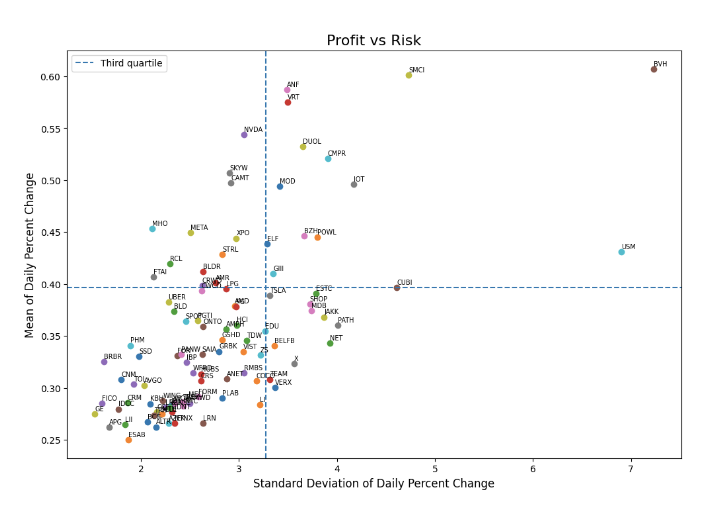

# About Me
The following projects are my endeavors in the data science field. I have a Bachelor of Science in Mathematics and have taught high school mathematics for six years. I'm currently a Data Analytics Fellow with Coop Careers and completed these projects to further apply what I've learned. 

# Visualizations
All my visuals can be found on my [Tableau Profile](https://public.tableau.com/app/profile/jocelyn.moreno/vizzes). Below are some notable dashboards:
* [A Store Customer Segment and Purchasing Behavior](https://coopcareers.brightspace.com/d2l/lms/dropbox/user/folders_history.d2l?db=1469&grpid=0&isprv=0&bp=0&ou=6969) visual where the percentage of the customer type is displayed \(Home Office, Corporate, and Consumer\) along with quarterly profit, a lifetime value boxplot, and bar graphs of purchases by category and subcategory.
    The typical customer is an everyday consumer who is buying office supplies. This can be used to take advantage by continuing to market our technology items such as phones, technology accessories, and copiers. An example of a marketing push is putting small technology accessories by the cashier aisle to entice buyers to grab before checking out. To read more about the key highlights and takeaways you can read it in this [one pager](https://docs.google.com/document/d/1qIkmuRIw0ezhGWkK863r6a1LQ7G4rNQC1njhZNCP14M/edit?usp=sharing)
* [The Airbnbs Rentals in Athens](https://public.tableau.com/app/profile/jocelyn.moreno/viz/AirbnbRentalsinAthen/Dashboard1) dashboard shows the most expensive neighborhood by price in bar graph and map form, and where the Airbnbs are located. All the visuals can be filtered by neighborhood in the filter located at the bottom. 

# Stocks 2023 Project
I analyzed Investor Business Daily's 100 Best Stocks 2023 and found the top 25% of stocks that are high reward and low risk. I imported the closing stock of yfiance database and cleaned the dataframe. I created a plot that is divided into four quadrants determined by the third quartile of the mean and standard deviation. The top left quadrant represents the highest profit with the lowest risk. 
 

The stocks in this quadrant are ‘NVDA’, ‘SKYW’, ‘CAMT’, ‘XPO’, ‘STRL’, AMR’, ‘BLDR’, ‘CRWD’, ‘META, ‘RCL’, ‘FTAI’, and ‘MHO’. The code can be found here on [github](https://github.com/mjclyn/Data-Science-Portfolio/blob/main/Stocks2023Project.ipynb) and the analysis summary can be found [here](https://docs.google.com/document/d/1sZhbHKJcIMRkBgv-FwrpaJw4TuuXVPfLh1NNdlwkUtk/edit?usp=sharing)
